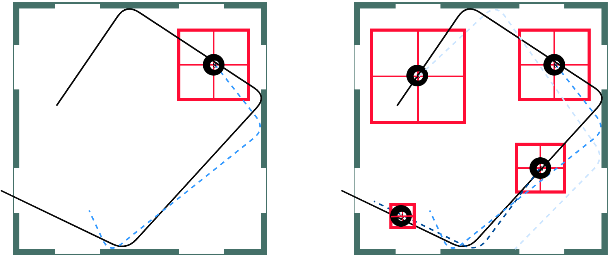

 

    
<h3>&nbsp;</h3>

  

    

    <h5><a href="https://mlevy2525.github.io/"> Mara Levy </a></h5>
  

    

  

    

    <h5> Vasista Ayyagari </h5>
  

    

    

    

    <h5><a href="http://www.cs.umd.edu/~abhinav/"> Abhinav Shrivastava </a></h5>
  

    

  
<h3>&nbsp;</h3>

 

<h5><a href="https://mlevy2525.github.io/files/DynamicPlanningAddOn.pdf">[Paper]</a></h5>

&nbsp;

&nbsp;

### Abstract

In this paper, we address the task of interacting with dynamic environments where the changes in the environment are independent of the agent. We study this through the context of trapping a moving ball with a UR5 robotic arm. Our key contribution is an approach to utilize a static planner for dynamic tasks using a Dynamic Planning add-on; that is, if we can successfully solve a task with a static target, then our approach can solve the same task when the target is moving. Our approach has three key components: an off-the-shelf static planner, a trajectory forecasting network, and a network to predict robot's estimated time of arrival at any location. We demonstrate the generalization of our approach across environments.

&nbsp;

&nbsp;

### Video



&nbsp;

&nbsp;

### Intermediate Goals

The key behind our paper is in the introducton of an intermediate goal. We take a normal static planner, which "observes" a state and goal at each step and then lay a planner on top of it which modifies the goal location so that the planner can function for a dynamic object.

<!--- ### Intermediate Goals

The key behind our paper is in the introducton of an intermediate goal. We take a normal static planner, which "observes" a state and goal at each step and then lay a planner on top of it which modifies the goal location so that the planner can function for a dynamic object.

In order to find the intermediate goal we will need two additional tools, a Trajectory Forecasting Network and an Estimated Time of Arrival Network.

&nbsp;
&nbsp; --->

&nbsp;

&nbsp;

### Estimated Time of Arrival(ETA) Network

The goal of this network is to determine how long it will take the arm from a specific position to "arrive" at a specific location on the table.

<!--- 

  

    

    
      

  

  

    

    
 The goal of this network is to determine how long it will take the arm from a specific position to "arrive" at a specific location on the table. To do this we use a simple Multi-Layer Perceptron Network. We discretize the ETA window of 500 time steps into 100 bins (e.g., 0-4 steps, 5-9 steps, etc.). In order to figure out which of these bins a state falls into we structure our network with 3 linear layers each with a ReLu activation network and a final layer which is also linear and outputs a probability to 100 different buckets using softmax. The output can be seen in the image below where red represents the locations the arms will reach the soonest and yellow represents the locations the arm will take the longest to reach. 

      

  

 --->

&nbsp;

&nbsp;

### Trajectory Forecasting Network
We opt for a faster, albeit potentially less accurate,approach than most trajectory forecasting approaches currently being used in Computer Science.

<!--- 

  

    

    
 We opt for a faster, albeit potentially less accurate,approach than most trajectory forecasting approaches currently being used in Computer Science. We modeled our approach on the paper "Convolutional Neural Network for Trajectory Prediction." Our method requires little knowledge about the actual environment and tries to predict F steps into the future given H steps of past information, where F >> H. Therefore,we sacrifice some accuracy to gain a real-time long-horizon prediction. This is necessary because, unlike in autonomous driving, the episode happens in a very short period of time. We  cannot  wait  to  gather  a  lot  of  prior  experience.  In  ourspecific  example,  we  use 24 steps  of  prior  information  to predict 300 steps of future information.  

  

    

    

      

    
        

  

 --->

&nbsp;

&nbsp;

### Dynamic Planner
We now take these tools and combine them to create our full dynamic planner.

#### Finding Interest Points

 
 We begin by predicting a new trajectory, the dotted line on the left, and finding the ETA from the current arm location to the current location of the ball. Both the current location of the arm and the current location of the ball can be seen in the middle image. Next we find the point where the ball will be when the arm reaches the current location of the ball. This can be seen on the right, essentially if we do not change the goal state and the arm keeps moving toward its original goal where will the ball be when the arm arrives. We now observe the distance, seen in green, between these two points. We are looking for how far the ball will move before the arm reaches the table. Once we have this distance we use it to draw a box around the current location of the ball and select the four corners as “interest points” for our next step
 

<!--- 

    

      

    
  

      

    

      

    
 We begin by predicting a new trajectory, the dotted line on the left, and finding the ETA from the current arm location to the current location of the ball. Both the current location of the arm and the current location of the ball can be seen in the middle image. Next we find the point where the ball will be when the arm reaches the current location of the ball. This can be seen on the right, essentially if we do not change the goal state and the arm keeps moving toward its original goal where will the ball be when the arm arrives. We now observe the distance, seen in green, between these two points. We are looking for how far the ball will move before the arm reaches the table. Once we have this distance we use it to draw a box around the current location of the ball and select the four corners as “interest points” for our next step
  

        

  

 --->

#### Selecting the Intermediate Goal

 Now, we calculate the ETA to each to each of the interest points and then look at where the ball will be according to the forecasted trajectory when the arm would reach each of the interest points.Using this we select the intermediate goal, which is the point along the forecasted trajectory that is closest to its matching interest point. We are trying to select a new goal location where we know the arm will be able to reach a nearby point in time so we estimate the arm can reach this new goal location in time as well. 

<!--- 

    

      

    
  

      

    

      

    
 Now, we calculate the ETA to each to each of the interest points and then look at where the ball will be according to the forecasted trajectory when the arm would reach each of the interest points.Using this we select the intermediate goal, which is the point along the forecasted trajectory that is closest to its matching interest point. We are trying to select a new goal location where we know the arm will be able to reach a nearby point in time so we estimate the arm can reach this new goal location in time as well.
  

        

  

 --->

#### Replannning

 Finally we show a re-plan. Our approaches differs from many robotics approaches because we do not replan at each step. Instead we re-plan on a calculated interval. It is easy to see that as the arm gets closer to the ball the ball will move less before the arm can reach is so our box will get smaller allowing the network to select more and more accurate goal locations as the episode goes on until the ball is properly trapped.

<!--- 

    

      

    
  

      

    

      

    
 Finally we show a re-plan. Our approaches differs from many robotics approaches because we do not replan at each step. Instead we re-plan on a calculated interval. It is easy to see that as the arm gets closer to the ball the ball will move less before the arm can reach is so our box will get smaller allowing the network to select more and more accurate goal locations as the episode goes on until the ball is properly trapped.
 

        

  

 --->

&nbsp;

&nbsp;
We put all of this together to get the following:

&nbsp;

&nbsp;

### Results



&nbsp;

&nbsp;

### Paper

<h5>
M Levy, V Ayyagari, A Shrivastava  
No-frills Dynamic Planning Using Static Planners  
ICRA, 2021.  
</h5>

<h5><a href="https://mlevy2525.github.io/DynamicAddOn/files/bibtex.txt">[Bibtex]</a></h5>

